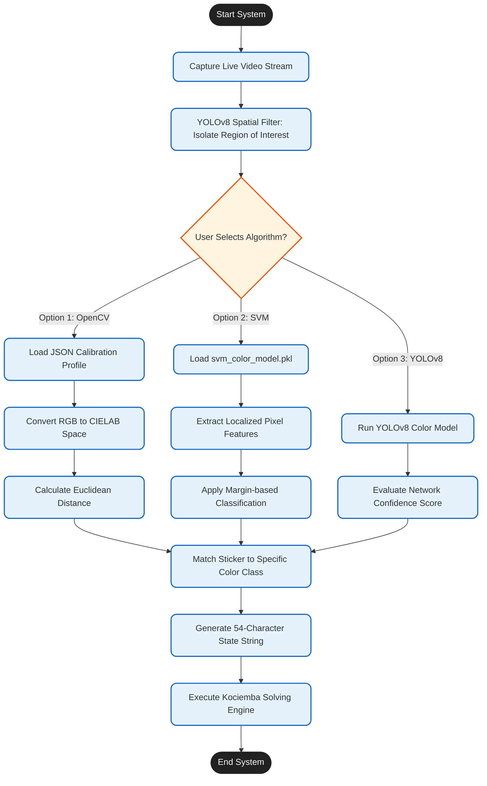

```mermaid
flowchart TD
    %% 定義起始與終止節點 (UML 實心圓角風格)
    Start([Start System]) --> Capture

    %% 共同活動區塊
    Capture[Capture Live Video Stream] --> Isolate
    Isolate[YOLOv8 Spatial Filter: Isolate Region of Interest] --> Decision

    %% 決策節點 (UML 菱形)
    Decision{User Selects Algorithm?}

    %% OpenCV 活動支線
    Decision -->|Option 1: OpenCV| LoadJSON[Load JSON Calibration Profile]
    LoadJSON --> ConvertLab[Convert RGB to CIELAB Space]
    ConvertLab --> CalcDist[Calculate Euclidean Distance]

    %% SVM 活動支線
    Decision -->|Option 2: SVM| LoadPKL[Load svm_color_model.pkl]
    LoadPKL --> ExtractFeat[Extract Localized Pixel Features]
    ExtractFeat --> ApplySVM[Apply Margin-based Classification]

    %% YOLOv8 活動支線
    Decision -->|Option 3: YOLOv8| RunYOLO[Run YOLOv8 Color Model]
    RunYOLO --> EvalConf[Evaluate Network Confidence Score]

    %% 匯總節點與後續活動
    CalcDist --> MatchColor
    ApplySVM --> MatchColor
    EvalConf --> MatchColor

    MatchColor[Match Sticker to Specific Color Class] --> GenString
    GenString[Generate 54-Character State String] --> ExecEngine
    ExecEngine[Execute Kociemba Solving Engine] --> End

    %% 終點
    End([End System])

    %% UML 活動圖樣式美化
    classDef startEnd fill:#212121,stroke:#212121,color:#ffffff,stroke-width:2px;
    classDef activity fill:#e3f2fd,stroke:#1565c0,stroke-width:2px,rx:10px,ry:10px;
    classDef decision fill:#fff3e0,stroke:#e65100,stroke-width:2px;

    %% 套用樣式
    class Start,End startEnd;
    class Capture,Isolate,LoadJSON,ConvertLab,CalcDist,LoadPKL,ExtractFeat,ApplySVM,RunYOLO,EvalConf,MatchColor,GenString,ExecEngine activity;
    class Decision decision;
```
