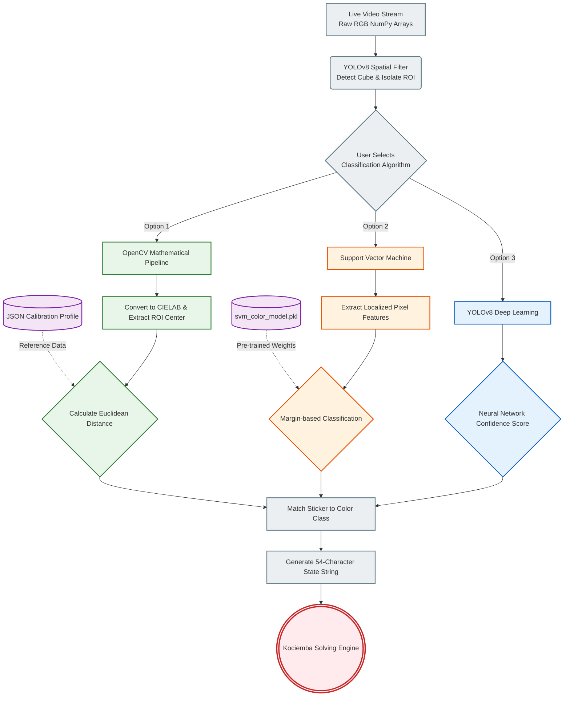

```mermaid
graph TD
    %% 共同輸入與空間定位 (Stage 1)
    A[Live Video Stream <br> Raw RGB NumPy Arrays] --> B(YOLOv8 Spatial Filter <br> Detect Cube & Isolate ROI)
    
    %% 使用者選擇演算法
    B --> C{User Selects <br> Classification Algorithm}

    %% 支線 1: OpenCV (傳統電腦視覺)
    C -->|Option 1| D[OpenCV Mathematical Pipeline]
    D --> E[Convert to CIELAB & Extract ROI Center]
    H[(JSON Calibration Profile)] -.->|Reference Data| F
    E --> F{Calculate Euclidean Distance}
    F --> J

    %% 支線 2: SVM (機器學習)
    C -->|Option 2| G[Support Vector Machine]
    G --> G1[Extract Localized Pixel Features]
    S[(svm_color_model.pkl)] -.->|Pre-trained Weights| G2
    G1 --> G2{Margin-based Classification}
    G2 --> J

    %% 支線 3: YOLOv8 (深度學習端到端)
    C -->|Option 3| I[YOLOv8 Deep Learning]
    I --> I1{Neural Network Confidence Score}
    I1 --> J

    %% 匯總與最終輸出
    J[Match Sticker to Color Class] --> K[Generate 54-Character State String]
    K --> L(((Kociemba Solving Engine)))

    %% 樣式美化 (用不同顏色區分三種演算法)
    classDef common fill:#eceff1,stroke:#607d8b,stroke-width:2px;
    classDef opencv fill:#e8f5e9,stroke:#2e7d32,stroke-width:2px;
    classDef svm fill:#fff3e0,stroke:#e65100,stroke-width:2px;
    classDef yolo fill:#e3f2fd,stroke:#1565c0,stroke-width:2px;
    classDef database fill:#f3e5f5,stroke:#7b1fa2,stroke-width:2px;
    classDef engine fill:#ffebee,stroke:#c62828,stroke-width:3px;
    
    %% 套用樣式
    class A,B,C,J,K common;
    class D,E,F opencv;
    class G,G1,G2 svm;
    class I,I1 yolo;
    class H,S database;
    class L engine;
```
